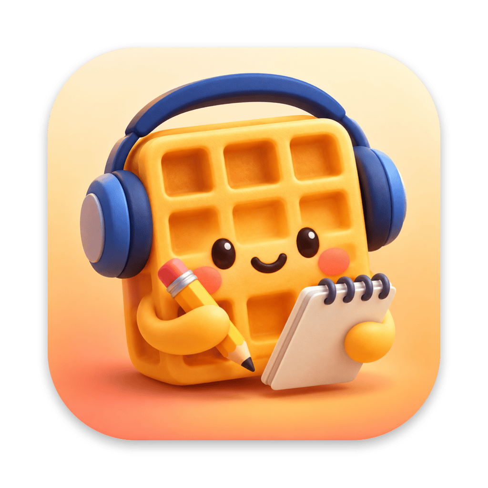
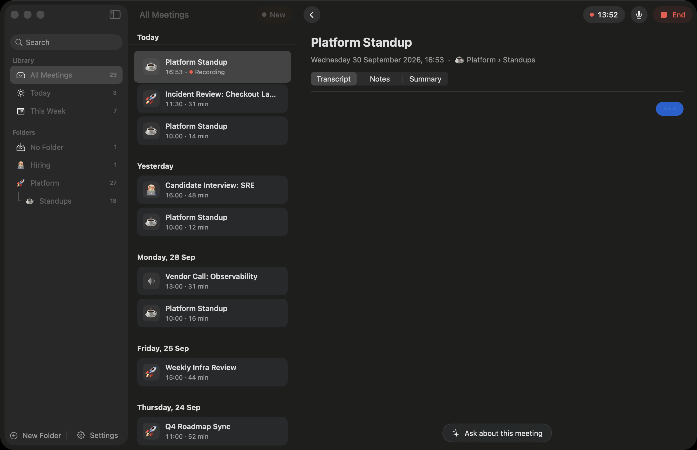
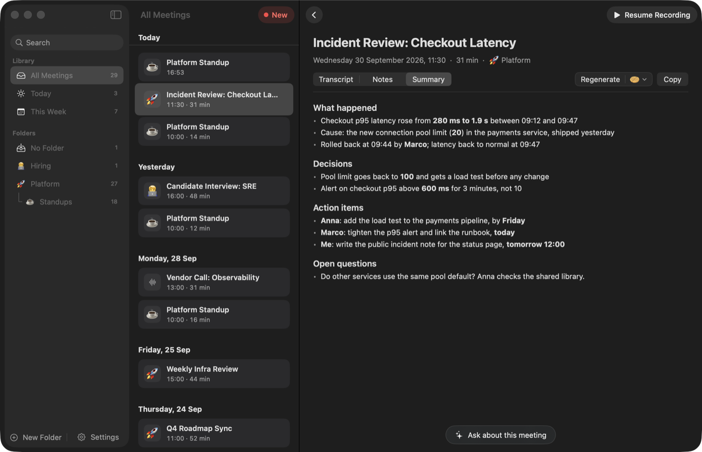
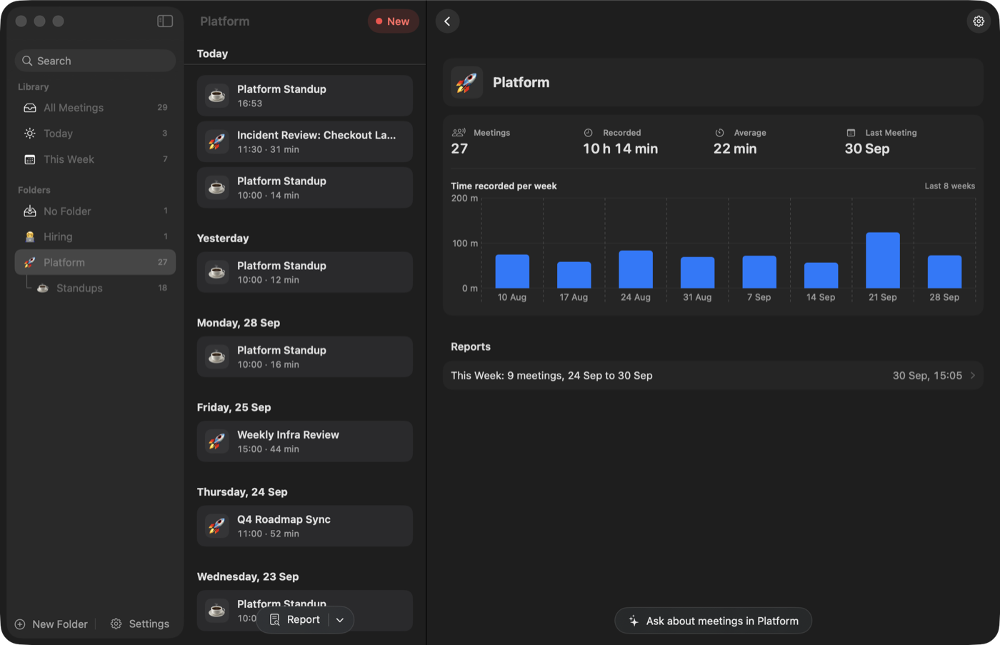

<div align="center">



# Waffle

**Meeting notes that write themselves, privately on your Mac.**

Live transcript of every call, speakers told apart, and clean notes when the call ends. Speech is recognised on your Mac; audio is never stored and never uploaded.




</div>

## Why Waffle

|  |  |
|---|---|
| **Any call app** | Zoom, Teams, Meet, Slack, FaceTime: Waffle hears your Mac's sound and your microphone. No bot joins the call. |
| **Private by design** | Speech recognition runs on your Mac's GPU. Audio lives only in memory and is gone after recognition. |
| **Your AI, your plan** | Summaries and answers come from the tool you already use: [Claude Code](https://claude.com/claude-code) or [Codex](https://developers.openai.com/codex/cli). No API keys, no extra subscription. |
| **Free and open** | Build it from source in one command. No App Store, no account, no telemetry. |

## Install

You need a Mac with **Apple Silicon** (M1 or newer), **macOS 15** or newer, the **Xcode Command Line Tools** (`xcode-select --install`) and [Homebrew](https://brew.sh).

```sh
git clone https://github.com/OuFinx/waffle.git
cd waffle
./install.sh
```

`install.sh` checks your Mac, installs the speech library (`whisper-cpp` from Homebrew), creates a free local signing certificate so macOS remembers Waffle's permissions, builds the app and puts it in **Applications**. The first build takes a few minutes.

To update later: `git pull && ./install.sh`.

## First launch

Waffle walks you through everything in a short setup:

1. **Speech models**: about 700 MB, downloaded once with a progress bar. They stay on your Mac.
2. **Microphone**: so Waffle hears your side of the call.
3. **System audio**: so it hears the other people. macOS calls this *Screen & System Audio Recording*; Waffle takes only the sound, never the screen. macOS may ask you to reopen Waffle after allowing it.
4. **Your AI**: pick Claude Code or Codex and sign in. Waffle shows whether each one is installed and connected.

Then join a call: Waffle notices the call app taking the microphone and offers to record. Or click **New** any time.

<p align="center">
  
  
</p>

## What it does

**During the call**
- **Live transcript** in English, Ukrainian and 23 other European languages, detected automatically, even mixed in one call.
- **Who said what**: you are "Me"; the other side is split into voices you can name with a click. Waffle also fills in names that are clear from the conversation.
- **Edge tab and popup**: a small tab at the screen edge shows live sound levels; click it for the transcript as a chat, with a notes field. Pin it to keep it open.
- **Mute yourself in Waffle** when you mostly listen: your microphone stops being transcribed, the call still hears you.
- **Stops by itself** when the call app releases the microphone or after a long silence.

**After the call**
- **Summary**: topics, decisions, owners, dates and next steps, built around your own notes if you wrote any. 10 built-in templates (Standup, One-on-one, Incident review, Customer call and more) plus your own.
- **Ask anything** about one meeting, a folder, or all meetings. Answers link back to the meetings they came from.
- **Copy for Slack or email**: rich text with bold and nested bullets intact.

**Organising**
- **Folders and subfolders** with emojis, shown as a tree. Drag meetings between them; Waffle files new meetings into matching folders by itself.
- **Reports**: one report over a folder's meetings for today, this week, this month or picked meetings, in the folder's own template. Every report is kept.
- **Stats** per folder: meetings, time recorded, average length and a weekly chart.
- **Search** across titles, notes, summaries and transcripts.
- **Survives crashes**: a meeting cut off by a crash or quit can be continued or summarised later.

## Privacy

| What | Where it goes |
|---|---|
| Audio | Recognised in memory on your Mac by [Parakeet](https://huggingface.co/nvidia/parakeet-tdt-0.6b-v3), then discarded. Never written to disk. |
| Voices | Told apart on your Mac by [LS-EEND](https://huggingface.co/FluidInference/lseend-coreml) via [FluidAudio](https://github.com/FluidInference/FluidAudio). |
| Transcripts, notes, summaries | Plain files in `~/Library/Application Support/Waffle`. |
| Transcript text | Sent to your AI (Claude Code or Codex, with your own sign-in) only when a summary or report is made or you ask a question. |

Recording a conversation may need the consent of everyone in it where you live. Let people know when Waffle is on.

## Troubleshooting

- **No sound from the other side**: allow Waffle in System Settings > Privacy & Security > Screen & System Audio Recording, then quit and reopen it.
- **"Claude Code / Codex is not installed"**: install it, sign in once in Terminal (`claude` or `codex`), then click the arrow in Settings to check again.
- **Waffle does not open after `brew upgrade`**: the speech library changed version. Run `./install.sh` again to rebuild against it.
- **Setup again**: Settings > Show Setup Again.

To uninstall, delete `/Applications/Waffle.app` and, if you want your meetings gone too, `~/Library/Application Support/Waffle`. The signing certificate is "Waffle Local Signing" in Keychain Access.

## How it works

One native SwiftUI app, no server and no web views.

| File | Role |
|---|---|
| `Sources/Waffle/Recorder.swift` | Microphone (AVAudioEngine with echo cancellation) and system audio (ScreenCaptureKit) into Parakeet on the GPU; finished sentences are locked as soon as the next one starts; LS-EEND speaker diarization |
| `Sources/Waffle/AI.swift` | Summaries and answers through `claude -p` or `codex exec`, without tools, hooks or the user's own config |
| `Sources/Waffle/Logic.swift` | Sentence locking, echo filter, speaker labels, prompts, templates, dates; checked by `Tests/main.swift` (`./build.sh test`) |
| `Sources/Waffle/Store.swift` | Meetings, folders and reports as plain files |
| `Sources/Waffle/Model.swift` | Recording, auto stop, summaries, reports, chat, navigation |
| `Sources/Waffle/Views.swift`, `Panels.swift`, `Setup.swift`, `App.swift` | Main window, edge tab and popup, first-run setup, menu bar |

While recording, transcription uses about 3% CPU and 700 MB of memory.

## License

[MIT](LICENSE)
